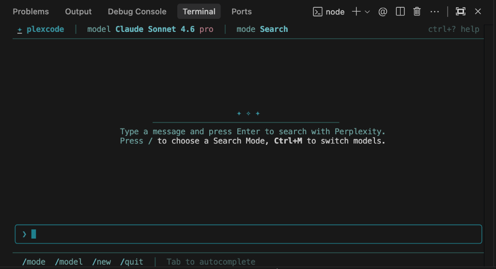

<div align="center">

<h1>✦ PlexCode</h1>

<p><strong>Perplexity AI — right in your terminal.</strong><br/>
A fast, beautiful TUI for Perplexity Pro powered by Playwright. No API key needed.</p>

[](https://www.npmjs.com/package/plexcode)
[](https://nodejs.org)
[](LICENSE)
[](https://playwright.dev)
[](https://github.com/efekurucay/plexcode/pulls)

<br/>



</div>

---

## What is PlexCode?

PlexCode is an open-source terminal UI (TUI) that brings your Perplexity Pro session to the command line. Instead of switching browser tabs, you can search, research, and write code — all without leaving the terminal.

It works by driving Perplexity's web interface via Playwright in headless mode, using your existing login session. No API key, no extra subscription.

**⚡ Agentic mode** teaches Perplexity to autonomously read your local files before answering — like a lightweight coding assistant that actually knows your codebase.

---

## Features

- **Full Perplexity access** — Deep Research, Model Council, Create, Learn modes
- **Model switching** — Sonar, Claude Sonnet/Opus, GPT-5.4, Gemini, Nemotron
- **Agentic mode** — AI reads local files via whitelisted shell tools (`/agent`)
- **Session persistence** — log in once, runs headless forever after
- **Fast startup** — uses your existing Chrome installation to dodge bot detection
- **Zero API cost** — your Perplexity Pro session, your data


---

## Quick Start

### Install

```bash
npm install -g plexcode
```

### First run (browser login)

```bash
plexcode
```

A Chrome window opens. Log in to Perplexity, then press **Enter** in the terminal. Your session is saved — future runs are fully headless.

### One-shot prompt

```bash
plexcode "explain the CAP theorem in simple terms"
```

---

## Slash Commands

| Command | Description |
|---------|-------------|
| `/agent` | Toggle agentic mode — AI can read your local files |
| `/mode` | Switch search mode (Deep Research, Create, Learn…) |
| `/model` | Switch AI model |
| `/new` | Start a new conversation |
| `/help` | Show all commands |
| `/logout` | Clear saved session |
| `/quit` | Exit PlexCode |

### Keyboard Shortcuts

| Key | Action |
|-----|--------|
| `Enter` | Send message |
| `Escape` | Interrupt AI generation |
| `Ctrl+C` | Quit |

---

## Agentic Mode

Type `/agent` to enable the **Shadow Agentic Loop** — PlexCode injects a hidden system prompt teaching Perplexity how to request local file reads. As the AI answers your question, it can autonomously run whitelisted commands to gather context:

```
> /agent
⚡ Agentic mode ON — I can now read your local files.

> what does browser.ts do?
  [⚡ Tool 1/4: ls src/lib/]
  [⚡ Tool 2/4: cat src/lib/browser.ts]
  → Full code-aware explanation
```

**Allowed commands:** `cat`, `ls`, `head`, `tail`, `grep`, `find`, `wc`, `pwd`, `file`, `tree`

Shell injection, pipes, and write-capable commands are **blocked**.

---

## How It Works

```
Your prompt
    │
    ▼
PlexCode (Ink TUI)
    │  Playwright (headless Chrome)
    ▼
perplexity.ai  ←──────────────────────────────────────────────┐
    │  Response stream                                          │
    ▼                                                           │
Detect <TOOL> tag?                                             │
    ├── Yes → executeTool() → [Tool Result] message ───────────┘
    └── No  → clean response → display in TUI
```

PlexCode parses the Perplexity DOM response, intercepts `<TOOL>` XML tags emitted by the model, executes the command locally (up to 4 iterations), and feeds results back — all without any native function-calling API.

---

## Configuration

Settings are persisted via [`conf`](https://github.com/sindresorhus/conf) at `~/.config/plexcode/`:

| Setting | Description | Default |
|---------|-------------|---------|
| `defaultModel` | Model ID on startup | `sonar` |
| `defaultMode` | Search mode on startup | `default` |

---

## Requirements

- **Node.js** ≥ 18
- **Google Chrome** installed locally *(recommended — avoids bot detection)*
- A **Perplexity Pro** account

---

## Development

```bash
git clone https://github.com/efekurucay/plexcode
cd plexcode
npm install
npm run dev
```

```bash
npm run build   # compile TypeScript → dist/
```

### Project Structure

```
src/
├── cli.tsx              # CLI entry point (Commander)
├── app.tsx              # Main React/Ink app
├── types.ts             # Types, models, modes
├── theme.ts             # Color palette
├── components/
│   ├── Header.tsx
│   ├── MessageList.tsx
│   ├── Message.tsx
│   ├── InputArea.tsx
│   ├── Spinner.tsx
│   ├── ModelPicker.tsx
│   ├── ModePicker.tsx
│   └── LoginScreen.tsx
└── lib/
    ├── browser.ts       # Playwright engine + agentic loop
    ├── toolExecutor.ts  # Whitelisted local command runner
    ├── config.ts        # Persistent settings
    └── markdown.ts      # ANSI markdown renderer
```

---

## Known Limitations

| Limitation | Notes |
|------------|-------|
| Sequential requests | One request at a time (browser-based) |
| Selector fragility | Perplexity UI updates may break DOM parsing |
| Long context | Very deep threads may get truncated by Perplexity |
| Rate limits | Perplexity's own web rate limits still apply |
| ToS | Automating the web UI may violate Perplexity's ToS — personal use only |

---

## Contributing

PRs and issues are welcome! If Perplexity updates their UI and PlexCode breaks, the relevant selectors are in `src/lib/browser.ts`:

```typescript
const INPUT_SELECTORS = [
  "[role='textbox']",
  'textarea#ask-input',
  'textarea',
  "[contenteditable='true']",
];
```

Use Chrome DevTools on perplexity.ai to find updated selectors.

---

## License

[MIT](LICENSE) © [Efe Kurucay](https://github.com/efekurucay)

---

<div align="center">
  <sub>Built with ♥ using <a href="https://github.com/vadimdemedes/ink">Ink</a>, <a href="https://playwright.dev">Playwright</a>, and too much coffee.</sub>
</div>
